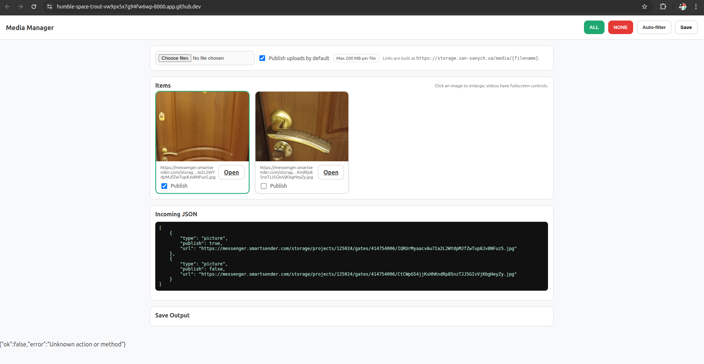

# dima-project

Yes ✅ — your **PHP 7.0.33 app** will run fine on a Linux server with just a terminal or Git bash. Here’s what you need to do step-by-step:

---

### 1. Check PHP version

```bash
php -v
```

Make sure it says something like `PHP 7.0.33`.

---

### 2. Create a project folder

```bash
mkdir media_manager && cd media_manager
```

---

### 3. Copy in the two files

Save the `index.php` and `api.php` from the code in index.hp present into this file.
Make it separate

---

### 4. Create an uploads directory

```bash
mkdir uploads
chmod 777 uploads
```

> `chmod 777` is just for testing; later you can tighten permissions (e.g., chown to web server user).

---

### 5. Run PHP built-in server (if you don’t have Apache/Nginx)

```bash
php -S 0.0.0.0:8000
```

This starts a test web server on port `8000`.

---

### 6. Open in browser

On your local machine (if same server):

```
http://localhost:8000/index.php
```

If it’s a remote Linux server, open:

```
http://your-server-ip:8000/index.php
```

---

### 7. Test with JSON input

Example:

```
http://localhost:8000/index.php?json=[{"type":"picture","publish":true,"url":"https://...jpg"}]
```

---

### 8. After Save

It will create/update `data.json` in the same directory, simulating a database.

---

👉 So yes, it will run on your Linux terminal. You don’t *need* Apache/Nginx; the built-in PHP server is enough for testing. For production, drop these two files into your web root of Apache/Nginx with PHP-FPM enabled.

---


Project Output
